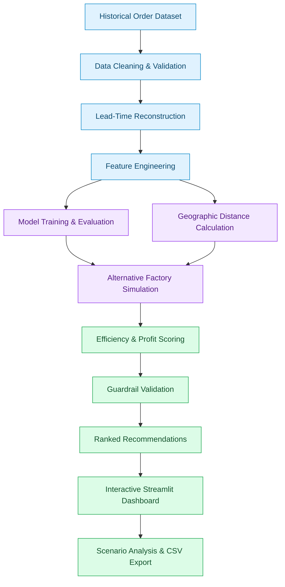

# 🍬 Factory Reallocation & Shipping Optimization Recommendation System

### Nassau Candy Distributor | Machine Learning • Decision Intelligence • Supply Chain Optimization

<p align="center">
  
  
  
  
  
</p>

<p align="center">
  <strong>Turning Supply Chain Data into Smarter Factory Allocation Decisions.</strong>
  <br/>
  An interactive decision-intelligence platform that predicts shipping lead times, simulates factory-product reassignments, and recommends data-driven allocation strategies to reduce shipping distances while protecting profitability.
</p>

<p align="center">
  <a href="https://factory-reallocation-shipping-optimization-recommendation-beus.streamlit.app/">🚀 Live Demo</a> •
  <a href="https://github.com/Sakshipriya05/Factory-Reallocation-Shipping-Optimization-Recommendation">📂 Repository</a> •
  <a href="#-installation--setup">⚙️ Installation</a> •
  <a href="#-results--business-impact">📊 Results</a>
</p>

---

## 📌 Table of Contents

* [🎯 Project Overview](#-project-overview)
* [💡 Business Problem](#-business-problem)
* [📊 Dataset at a Glance](#-dataset-at-a-glance)
* [✨ Key Features](#-key-features)
* [🔍 Key Business Insights](#-key-business-insights)
* [🧠 Technical Methodology](#-technical-methodology)
* [📈 Results & Business Impact](#-results--business-impact)
* [🖥️ Dashboard Preview](#️-dashboard-preview)
* [🏗️ System Architecture](#️-system-architecture)
* [📁 Project Structure](#-project-structure)
* [🛠️ Tech Stack](#️-tech-stack)
* [⚙️ Installation & Setup](#️-installation--setup)
* [☁️ Deployment](#️-deployment)
* [⚠️ Assumptions & Limitations](#️-assumptions--limitations)
* [🔮 Future Enhancements](#-future-enhancements)
* [📚 Project Documentation](#-project-documentation)
* [👤 Author](#-author)

---

## 🎯 Project Overview

The **Factory Reallocation & Shipping Optimization Recommendation System** is a machine learning-powered decision-support application developed for the Nassau Candy Distributor supply chain.

The system evaluates how changing the factory responsible for manufacturing a product could affect shipping distance, delivery lead time, route reliability, and estimated profitability.

Instead of relying entirely on fixed factory assignments, users can explore alternative scenarios through an interactive Streamlit dashboard and evaluate recommendations before making real-world operational changes.

### 🌟 What makes this project different?

* **Predictive analytics:** Estimates shipping lead time for alternative factory assignments.
* **What-if simulation:** Tests hypothetical factory-product allocations without modifying the actual supply chain.
* **Recommendation engine:** Ranks potential reassignments using efficiency and profitability criteria.
* **Risk-aware decision support:** Applies volume, profit, and minimum-improvement guardrails.
* **Interactive visualization:** Presents comparisons, geographic patterns, and operational impacts in one dashboard.

> **Core objective:** Identify promising factory reassignment opportunities that reduce transportation distance and estimated logistics costs without compromising profitability.

---

## 💡 Business Problem

Traditional factory allocation strategies can create geographically inefficient shipping routes.

For example, a factory located in the southwestern United States might serve customers on the Atlantic coast, while a southeastern factory ships products to customers on the Pacific coast.

This can lead to:

* 🚚 Unnecessarily long transportation routes.
* ⏱️ Inefficient shipping operations.
* 💰 Increased estimated logistics expenses.
* 📉 Potential pressure on profit margins.
* 🏭 Uneven distribution of order volumes across factories.
* ❓ Limited visibility into the consequences of changing product assignments.

### 💻 Our approach

This project combines historical order analysis, lead-time prediction, geographic distance calculations, scenario simulation, and recommendation scoring to answer a practical business question:

**"What if a product were manufactured at a different factory? Would the new assignment improve shipping efficiency and remain financially viable?"**

The application evaluates alternative assignments using historical data and explicitly defined assumptions. Its recommendations are intended to support business decisions, not automatically execute factory transfers.

---

## 📊 Dataset at a Glance

The project analyzes historical order-level data from the Nassau Candy Distributor dataset.

<p align="center">
  
  
  
  
  
</p>

| Dataset Attribute     | Details                      |
| --------------------- | ---------------------------- |
| Historical period     | January 2024 – December 2025 |
| Order lines           | 10,194                       |
| Orders                | 8,549                        |
| Customers             | 5,044                        |
| Factories             | 5                            |
| Products              | 15                           |
| Geographic coverage   | United States and Canada     |
| Recorded sales        | Approximately $141.8K        |
| Reported gross margin | 65.9%                        |

*Financial figures and reported margins reflect the supplied dataset and its definitions.*

### Data preparation

The data pipeline includes:

* Parsing and validating order and shipping dates.
* Investigating and correcting the apparent date-shift artifact.
* Reconstructing shipping lead time.
* Mapping products to their historical factories.
* Calculating approximate factory-to-customer distances using geographic centroids.
* Encoding categorical variables and preparing numerical features.
* Identifying extreme observations using the 3×IQR rule.

**Data-quality note:** The date correction is inferred from observed patterns in the dataset and should be confirmed with the original data owner before operational use.

---

## ✨ Key Features

### 🏭 1. Factory Optimization Simulator

Explore alternative factories for a selected product and compare their estimated performance.

* Select a product, customer region, and shipping mode.
* Evaluate alternative factory assignments.
* Compare predicted lead time and approximate shipping distance.
* View factory locations and geographic relationships.
* Evaluate the impact of optimization priorities.

### 🔀 2. What-If Scenario Analysis

Test alternative allocation decisions before implementing them.

* Compare the current assignment against a proposed reassignment.
* Analyze different customer regions and shipping modes.
* Examine estimated efficiency and profit changes.
* Adjust cost assumptions to explore different business conditions.

### ⭐ 3. Recommendation Dashboard

Discover potentially beneficial factory-product reassignment opportunities.

* Rank candidate recommendations.
* Review estimated distance and efficiency improvements.
* Inspect profitability and feasibility guardrails.
* Export recommendation results to CSV for further analysis.

### ⚠️ 4. Risk & Impact Analysis

Understand the potential consequences of reallocating products.

* Estimated profit-impact alerts.
* Receiving-factory volume increase warnings.
* Cumulative factory-load analysis.
* Cost-assumption sensitivity checks.
* Identification of recommendations that may become less attractive under different scenarios.

### 📚 5. Model & Data Explorer

Explore the analytical foundations behind the recommendations.

* Compare machine learning models.
* Investigate geographic route clusters.
* Identify potentially inefficient product-region combinations.
* Review data-quality findings.
* Examine model performance and prediction limitations.

### 🎛️ Interactive controls

| Control                      | Purpose                                                         |
| ---------------------------- | --------------------------------------------------------------- |
| Product selector             | Choose a product to evaluate                                    |
| Region selector              | Focus on a customer region                                      |
| Shipping-mode filter         | Compare shipping services                                       |
| Optimization priority slider | Balance shipping efficiency against estimated profit            |
| Cost assumptions             | Test sensitivity to assumed transportation and production costs |

---

## 🔍 Key Business Insights

The exploratory analysis identified several important patterns.

### 1. Shipping-date inconsistencies

The raw difference between shipping and order dates ranged from approximately 904 to 1,642 days. The differences appeared in year-separated bands associated with order identifiers.

After removing the inferred whole-year offset, reconstructed lead times ranged from 0 to 11 days and aligned more closely with shipping modes.

### 2. Shipping mode is more informative than geographic distance

The analysis found that shipping mode was the strongest predictor among the evaluated features.

* Shipping mode explained approximately 62% of lead-time variance in the fitted model.
* The estimated distance coefficient was approximately 0.008 days per 1,000 km, with a reported p-value of 0.41.
* The factory effect was not statistically detectable in the reported analysis, with a p-value of 0.74.

These results suggest that factory reassignment may improve transportation efficiency without necessarily producing a meaningful improvement in delivery speed.

### 3. Geographic factory-allocation mismatch

The analysis identified potentially inefficient assignments involving two factories:

* **Lot's O' Nuts — Arizona**
* **Wicked Choccy's — Georgia**

Some Atlantic and Gulf demand was served from Arizona, while some Pacific demand was served from Georgia.

The resulting geographic mismatch motivated the evaluation of cross-factory reassignment scenarios.

### 4. Selective reallocation appears more promising than blanket reassignment

Only a subset of evaluated product-region combinations passed the project's recommendation guardrails.

The resulting recommendations prioritize selected assignments rather than suggesting that every product should be moved to a different factory.

### 5. Efficiency gains do not automatically mean faster delivery

Although alternative assignments can substantially reduce approximate transportation distance, predicted lead-time improvements remain small relative to model uncertainty.

The system therefore emphasizes **distance reduction, estimated logistics savings, and profitability protection** rather than promising faster delivery.

---

## 🧠 Technical Methodology

The project follows an end-to-end machine learning and decision-optimization workflow.

### 🔄 Workflow



### Step 1 — Data preprocessing

* Parse dates and investigate data-quality anomalies.
* Reconstruct lead-time values.
* Engineer geographic distance and categorical features.
* Remove selected extreme observations using the specified IQR rule.
* Prepare the model input features.

### Step 2 — Predictive modelling

Three regression models were compared:

| Model                       | Purpose                   |
| --------------------------- | ------------------------- |
| Linear Regression           | Interpretable baseline    |
| Random Forest Regressor     | Nonlinear ensemble model  |
| Gradient Boosting Regressor | Sequential boosting model |

The target variable is reconstructed shipping lead time in days.

Evaluation includes an 80/20 random split, five-fold cross-validation, and a time-based holdout using data before October 2025 for training and Q4 2025 for testing.

Metrics include:

* RMSE — Root Mean Squared Error.
* MAE — Mean Absolute Error.
* R² — Coefficient of Determination.

### Step 3 — Geographic analysis and clustering

* Estimate factory-to-customer distances using the haversine formula.
* Represent customer locations using state or province centroids.
* Apply K-means clustering to selected route and demand characteristics.
* Flag potentially inefficient routes and product-region combinations.

### Step 4 — Scenario simulation

For each eligible product and customer region:

1. Establish the current factory assignment.
2. Simulate alternative factory assignments.
3. Estimate lead time and transportation distance.
4. Evaluate route-related risk and estimated profit impact.
5. Compare alternative scenarios against the baseline.

### Step 5 — Recommendation scoring

The system combines shipping efficiency and estimated profitability into a configurable composite score.

**Speed index**

```text
Speed Index =
    35% × Lead-Time Component
  + 45% × Distance Component
  + 20% × Route-Volatility Component
```

**Composite score**

```text
Composite Score =
    w × Speed Score
  + (1 - w) × Profit Score
```

Here, `w` is controlled by the optimization-priority slider. The underlying components must be normalized consistently for this weighted combination to be meaningful.

### Step 6 — Recommendation guardrails

| Guardrail           | Rule                                                   |
| ------------------- | ------------------------------------------------------ |
| Historical support  | At least 30 historical orders                          |
| Profit protection   | No more than 1% estimated profit loss                  |
| Factory loading     | No more than 25% additional volume per individual move |
| Minimum improvement | Score gain of at least 0.03                            |

Only candidates satisfying the configured rules are eligible for recommendation.

*These are project-defined screening rules, not universal supply-chain standards.*

---

## 📈 Results & Business Impact

The following results are from the project's reported analysis and should be interpreted in light of its data and cost assumptions.

### Key performance indicators

| Metric                                                 |     Reported Result |
| ------------------------------------------------------ | ------------------: |
| Eligible recommendation scopes                         |             9 of 52 |
| Order volume covered                                   |   Approximately 39% |
| Products represented in recommendations                |             6 of 15 |
| Average distance on selected orders                    |   3,161 km → 970 km |
| Distance reduction on selected orders                  |   Approximately 69% |
| Predicted lead-time reduction                          | Approximately 0.48% |
| Estimated net profit impact over the historical period |             +$2,776 |
| Profitability stability under tested cost stresses     |                 89% |
| Scenario confidence score                              |              58/100 |

**Important:** The distance and profit figures are scenario-model outputs, not verified savings from actual factory transfers. The confidence score is a project-specific indicator, not a calibrated probability.

### Model comparison

| Model             |  RMSE |   MAE |    R² | Time-Holdout RMSE |
| ----------------- | ----: | ----: | ----: | ----------------: |
| Linear Regression | 1.109 | 0.930 | 0.618 |             1.196 |
| Random Forest     | 1.100 | 0.907 | 0.624 |             1.282 |
| Gradient Boosting | 1.096 | 0.919 | 0.626 |             1.277 |

### What do these metrics tell us?

* Gradient Boosting achieved the lowest reported random-split RMSE.
* Linear Regression performed best on the reported time-based holdout.
* The reported benchmark using the mean lead time for each shipping mode achieved an RMSE of 1.108.
* Because the predictive models improve only marginally over this benchmark, lead-time predictions should be treated cautiously.

**Model selection:** Linear Regression was selected as the simpler model with stronger reported time-holdout performance.

### Recommended allocation pattern

The analysis identified promising candidate patterns involving:

* Atlantic and Gulf demand for Lot's O' Nuts products being evaluated for production at Wicked Choccy's in Georgia.
* Pacific demand for Wicked Choccy's products being evaluated for production at Lot's O' Nuts in Arizona.

Actual feasibility depends on product-manufacturing capabilities, available capacity, production costs, and operational validation.

---

## 🖥️ Dashboard Preview

Add your actual screenshots to the `docs/screenshots/` directory to showcase the application's interface.

<table>
  <tr>
    <td align="center" width="50%">
      <strong>🏭 Factory Optimization Simulator</strong><br/>
      
    </td>
    <td align="center" width="50%">
      <strong>⭐ Recommendation Dashboard</strong><br/>
      
    </td>
  </tr>
  <tr>
    <td align="center" width="50%">
      <strong>⚠️ Risk & Impact Analysis</strong><br/>
      
    </td>
    <td align="center" width="50%">
      <strong>📚 Model & Data Explorer</strong><br/>
      
    </td>
  </tr>
</table>

---

## 🏗️ System Architecture

```text
                    ┌─────────────────────────┐
                    │   Historical CSV Data   │
                    └────────────┬────────────┘
                                 │
                    ┌────────────▼────────────┐
                    │  Data Preparation       │
                    │  Cleaning & Features    │
                    └────────────┬────────────┘
                                 │
                    ┌────────────▼────────────┐
                    │  ML Model & Clustering  │
                    │  Lead Time & Route Data │
                    └────────────┬────────────┘
                                 │
                    ┌────────────▼────────────┐
                    │  Scenario Simulation    │
                    │  Factory Reassignment   │
                    └────────────┬────────────┘
                                 │
                    ┌────────────▼────────────┐
                    │ Scoring & Risk Guardrails│
                    └────────────┬────────────┘
                                 │
                    ┌────────────▼────────────┐
                    │  Streamlit Dashboard    │
                    │  Insights & Export      │
                    └─────────────────────────┘
```

---

## 📁 Project Structure

```text
nassau/
│
├── app.py
│   └── Interactive Streamlit dashboard
│
├── engine.py
│   └── Prediction, clustering, simulation, scoring and KPIs
│
├── prep.py
│   └── Data cleaning, lead-time reconstruction and features
│
├── geo.py
│   └── Factory coordinates, product assignments and centroids
│
├── train.py
│   └── Model training and recommendation generation
│
├── analysis.py
│   └── Exploratory analysis, statistical tests and figures
│
├── data/
│   └── Nassau_Candy_Distributor.csv
│
├── artifacts/
│   └── Trained models, recommendation outputs and results
│
├── docs/
│   └── screenshots/
│       ├── simulator.png
│       ├── recommendations.png
│       ├── risk.png
│       └── model.png
│
├── reports/
│   ├── Research_Paper_Nassau_Candy.docx
│   ├── Executive_Summary_Nassau_Candy.docx
│   └── figures/
│
├── requirements.txt
└── README.md
```

*The structure above describes the intended repository layout. Keep only files and folders that actually exist in your GitHub repository.*

---

## 🛠️ Tech Stack

| Technology                | Role                                                     |
| ------------------------- | -------------------------------------------------------- |
| Python                    | Core programming language                                |
| Pandas & NumPy            | Data manipulation and numerical computation              |
| Scikit-learn              | Regression models, preprocessing, evaluation and K-means |
| Streamlit                 | Interactive web application                              |
| Plotly                    | Interactive charts and geographic visualizations         |
| Matplotlib / Seaborn      | Exploratory data analysis and statistical figures        |
| Joblib                    | Saving and loading trained model artifacts               |
| Git & GitHub              | Version control and project hosting                      |
| Streamlit Community Cloud | Optional public application deployment                   |

---

## ⚙️ Installation & Setup

### Prerequisites

* Python 3.11 or a compatible version supported by your dependencies.
* Git.
* A local copy of this repository.
* The dataset required by the application.

### 1. Clone the repository

```bash
git clone https://github.com/YOUR_USERNAME/YOUR_REPOSITORY.git
cd YOUR_REPOSITORY
```

### 2. Create a virtual environment

**Windows**

```bash
python -m venv venv
venv\Scripts\activate
```

**macOS / Linux**

```bash
python3 -m venv venv
source venv/bin/activate
```

### 3. Install dependencies

```bash
python -m pip install --upgrade pip
pip install -r requirements.txt
```

### 4. Launch the dashboard

```bash
python -m streamlit run app.py
```

Open the local URL displayed in your terminal, usually:

`http://localhost:8501`

### Optional: Rebuild model artifacts

```bash
python train.py
```

### Optional: Regenerate analytical results

```bash
python analysis.py
```

**Troubleshooting tip:** Ensure the CSV file is present at the expected path, the required model artifacts are available or can be regenerated, and the installed library versions are compatible with the saved models.

---

## ☁️ Deployment

The application can be deployed using Streamlit Community Cloud.

1. Push the project to a GitHub repository.
2. Open [Streamlit Community Cloud](https://share.streamlit.io/).
3. Create a new application.
4. Select your repository and branch.
5. Set `app.py` as the main application file.
6. Configure the Python version and dependencies.
7. Deploy and test the application.

Once deployment succeeds, add the public application URL near the top of this README.

**Before publishing:** Verify that the application works from a clean environment and that any required datasets and model artifacts are available to the deployed application. Do not commit confidential business data or credentials.

---

## ⚠️ Assumptions & Limitations

Transparency is important when using machine learning for operational recommendations.

### Data limitations

* The date correction is inferred from a pattern in the supplied data and requires confirmation.
* Customer locations use state or province centroids instead of precise delivery addresses.
* Straight-line distance is an approximation of actual transportation distance.
* Some products, including Sugar and Other, have insufficient order history for reliable recommendations.

### Financial assumptions

The dataset does not contain actual freight invoices or factory-specific production costs. Therefore, the current simulation uses configurable assumptions:

* Freight cost: `$0.10 per unit per 1,000 km`.
* Production-cost premium: `3%` when a product is assigned to a different factory.

Estimated profit impact depends on these assumptions and should not be interpreted as realized financial savings.

### Model limitations

* Historical observations do not establish what would have happened under alternative factory assignments.
* Counterfactual lead-time predictions rely on the fitted model and available features.
* The reported model improvements over the shipping-mode benchmark are small.
* The scenario confidence score is a custom indicator rather than a statistically calibrated confidence estimate.

### Operational limitations

* Product-manufacturing capabilities and actual factory capacities need stronger validation.
* Applying multiple recommendations together may create aggregate capacity constraints.
* The analysis indicates a potential receiving-factory volume increase of approximately 27% when recommendations are combined.

### Recommended next step

Validate a small number of high-value recommendations with real freight costs, production constraints, and a controlled operational pilot before implementing broader changes.

---

## 🔮 Future Enhancements

* [ ] Integrate actual freight invoices and carrier pricing.
* [ ] Add factory capacity and product-capability constraints.
* [ ] Introduce a constrained optimization algorithm for allocation decisions.
* [ ] Improve customer geocoding using city or postal-code data.
* [ ] Incorporate road-network distances and estimated transit times.
* [ ] Add route-level cost-to-serve and carbon-emissions estimates.
* [ ] Implement model monitoring and scheduled retraining.
* [ ] Track prediction accuracy against observed delivery outcomes.
* [ ] Run an 8–12 week pilot and evaluate actual changes against the baseline.
* [ ] Add downloadable executive reports and richer scenario comparisons.

---

## 📚 Project Documentation

The repository may also include the following supporting documents:

* **Research Paper:** `reports/Research_Paper_Nassau_Candy.docx` — methodology, statistical analysis, model evaluation and results.
* **Executive Summary:** `reports/Executive_Summary_Nassau_Candy.docx` — a concise business-oriented overview of the findings.

These paths should link to the corresponding files once they have been added to the repository.

---

## 👤 Author

**SAKSHI PRIYA**

🎓 B.Tech | Computer Science & Engineering (Data Science)

* 💻 GitHub: https://github.com/
* 💼 LinkedIn: www.linkedin.com/in/sakshi-priya-3a33aa338
* 📧 Email: sakshipriya14508@gmail.com

---

## ⭐ Support the Project

If you find this project useful, consider giving the repository a ⭐ on GitHub.

Suggestions, feedback, and ideas for improving the recommendation engine are welcome.

<p align="center">
  <strong>🍬 From Historical Orders to Smarter Supply Chain Decisions.</strong>
  <br/>
  Built as part of the Unified Mentor project.
</p>
